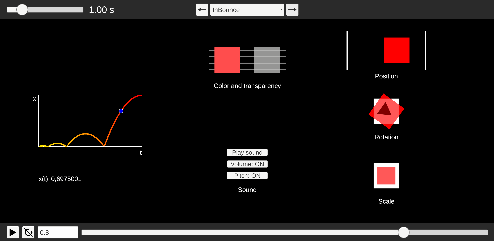

# Easing
[Easing.cs](Easing.cs) contains C# implementation of easing functions featured on [easings.net](https://easings.net) by [Andrey Sitnik](https://sitnik.ru/en) and [Ivan Solovev](https://solovev.one).  
These functions are widely used in animation, UI transitions, and procedural motion to create smooth, natural, and expressive effects.

They’re ideal for:

- Tweening UI elements
- Smooth camera transitions
- Procedural motion
- Custom animation curves

## 🚀 Quick Start
To use the `Easing` class, first choose an easing function from the `Ease` enum.  
Then pass a normalized progress value (`0.0f` to `1.0f`) to the easing method.

In the example below:
- `progress` is calculated based on the current animation time and total duration
- `valueA` uses the generic `Easing.Ease(x, ease)` method
- `valueB` calls the specific `InSine` easing function directly

Both will return the same result:
```csharp
float progress = Mathf.Clamp01(time / duration);
Ease ease = Ease.InSine;
float valueA = Easing.Ease(progress, ease);
float valueB = Easing.InSine(progress);
```
`Ease.InSine` is one of many easing types available in the `Ease` enum — including `OutQuad`, `InOutCubic`, `OutBounce`, and more.

## 🎯 Sample Usage
Sample code below shows how to use `Easing` to animate a transform's position and an image's transparency.
```csharp
// Ease position - smoothly interpolate between two positions using the selected easing
transform.localPosition = Vector3.LerpUnclamped(startPosition, endPosition, Easing.Ease(progress, ease));

// Ease transparency - fade out from fully visible (1.0) to invisible (0.0)
Color color = transparencyEasingImage.color;
color.a = Mathf.LerpUnclamped(1.0f, 0.0f, Easing.Ease(progress, ease)); // lerp from 1.0 to 0.0 to create fade out effect
transparencyEasingImage.color = color;
```
For more examples, see the [`EasingTest`](Sample/EasingTest.cs).`OnProgressChanged()` method in the source code.

## 🎮 Sample Scene
Usage and visualization of easing functions are demonstrated in the [`EasingSample.unity`](Sample/EasingSample.unity) scene and the accompanying [`EasingTest.cs`](Sample/EasingTest.cs) script - particularly in the `OnProgressChanged()` method.


The sample showcases:
- 📈 A graph of the selected easing function with current `x(t)` value
- 🎨 Easing applied to image color and transparency
- 🔊 Easing applied to audio playback
- 📍 Easing applied to position, rotation, and scale transformations
- 🎛️ Controls to select easing type, play/loop animation, and adjust its duration

## 📜 License
Original easing formulas adapted from [easings.net](https://easings.net),
used with attribution to the original authors.

---

✅ Samples tested with Unity 6000.0 LTS